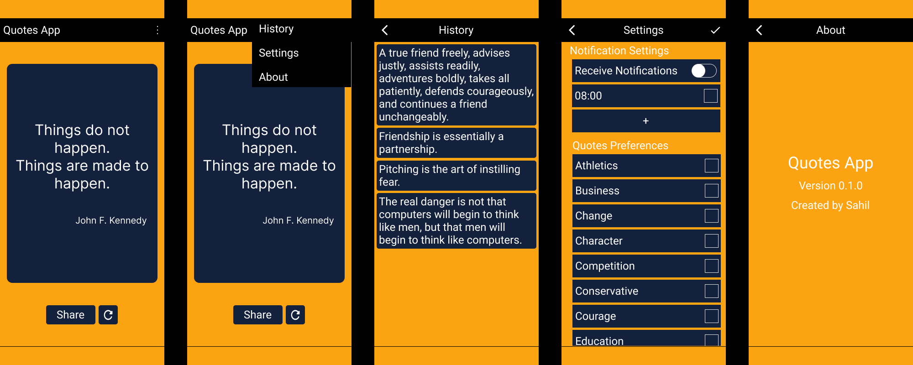

# Quotes App

### Quotes App, An Android application designed to Inspire and Motivate users with a Collection of powerful and inspiring quotes.

#### Demo Video

<iframe width="480px" height="720px" src="https://www.youtube.com/embed/oIM1kIXbyNc" title="Quotes App preview" frameborder="0" allow="accelerometer; autoplay; clipboard-write; encrypted-media; gyroscope; picture-in-picture; web-share" allowfullscreen></iframe>

### Table of Contents

1.  **[Download Link](#download-link)**
2.  **[Features of Application](#features-of-application)**
3.  **[Screenshots](#screenshots)**
4.  **[How to Use This App](#how-to-use-this-app)**
    - [How to See History](#how-to-see-the-history)
    - [How to Get Personalized Quotes](#get-personalized-quotes)
    - [How to Set Notifications](#set-notifications)
    - [How to Set Widget](#use-the-widget)
5.  **[How to Build Your Own Version of This App](#how-to-build-your-own-version-of-this-app)**
6.  **[Acknowledgement, Credits, and Tools](#credits-and-tools-used)**

### Download Link

You can download the app from [Here](./quotes-app.apk) or [Here](https://drive.google.com/file/d/1cHNz43xmqVt1IP2ZX9fd3kIrwS4pEAZW/view?usp=sharing).

### Features of Application

1. View Quotes
2. Change Quote
3. Share Quote
4. Set Notifications
5. Personalized Tags
6. Home Screen Widget
7. View History of Quotes

### Screenshots



### How to Use This App

##### How to see the history

1. Open Quotes App
2. Click on 3 Dot
3. Select History opetion

Here you can see all past quotes.

##### Get personalized quotes

To get Quotes suits you

1. Open Quotes App
2. Click on 3 Dot button
3. Select Settings
4. Check the tags in Preferences you like

Now you will see quotes according to your preference.

##### Set notifications

Use Notification feature to get Quote notification anytime you want

1. Open Quotes App
2. Click on 3 Dot button
3. Select Settings
4. Now you will see toggle button to enable and disable notification
5. You will see a + icon also
6. Using + icon you can add time on which you want to get Quote notification

##### Use the widget

1. Click on empty space in your home screen
2. You will see option to add Widgets
3. Find the Quotes App widget
4. Press and hold to select the widget and release after reaching to exact place on honescreen.

Now you can see Quote just from your homescreen and this Quote will get updated in every half day,

### How to Build Your Own Version of This App

1. Clone the repository using the following command:

```bash
git clone https://github.com/Sahil-4/Quotes-App
```

2. Open the Quotes App project in Android Studio.

3. Customize the code to match your requirements.

4. Build the app using Android Studio's build tools.

### Credits, and Tools Used

1. [MVVM Architecture](https://developer.android.com/topic/architecture)

2. [Quotable - Random Quotes API](https://github.com/lukePeavey/quotable)

3. [Cronet - For making api calls](https://developer.android.com/codelabs/cronet#0)

4. [GSON Library - To parse JSON Object](https://github.com/google/gson)

5. [Room Database](https://developer.android.com/training/data-storage/room)

6. [Shared Preferences](https://developer.android.com/training/data-storage/shared-preferences)
